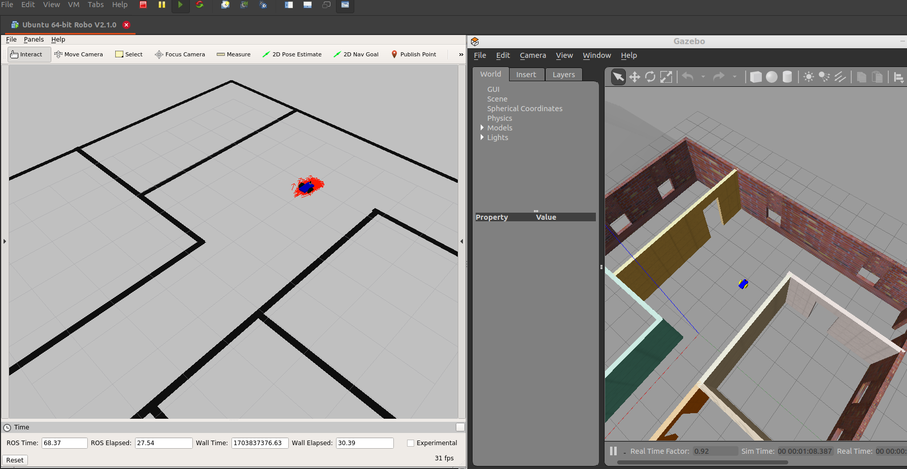

# Project 3: Where Am I
Custom designed mobile robot localizes in the Gazebo world using ROS Adaptive Monte-Carlo Localization ([AMCL](http://wiki.ros.org/amcl)) package, which dynamically adjusts the number of particles over a period of time, as the robot navigates around in a map.\
Also, there were added and fine-tuned to achieve the best possible localization results general filter parameters such as:
- max_particles: maximum allowed number of particles.
- update_min_d: translational movement required before performing a filter update.
- update_min_a: rotational movement required before performing a filter update.
- resample_interval: number of filter updates required before resampling.
- transform_tolerance: time with which to post-date the transform that is published, to indicate that this transform is valid into the future.
and sensor model parameters:
- laser_max_beams: how many evenly-spaced beams in each scan to be used when updating the filter.
- laser_z_hit: mixture weight for the z_hit part of the model.
- laser_z_short: mixture weight for the z_short part of the model.
- laser_z_max: mixture weight for the z_max part of the model.
- laser_z_rand: mixture weight for the z_rand part of the model.



To start the project, run in the project's catkin workspace root directory (e.g. `~/project/catkin_ws`).
1. Option: uncomment "move_base" node definition in `~/project/catkin_ws/src/amcl_bot/launch/amcl.launch` send `2D Nav Goal` from RViz (if `move_base` couldn't find a path, change parameters in `costmap_common_params.yaml` such as `inflation_radius`):
```
# 1st terminal
$ catkin_make
$ source devel/setup.bash
$ roslaunch amcl_bot world.launch  # start ROS Master, spawn the world and robot

# 2nd terminal
$ source devel/setup.bash
$ roslaunch amcl_bot amcl.launch  # run amcl and move_base nodes
```

2. Option: comment "move_base" node definition in `~/project/catkin_ws/src/amcl_bot/launch/amcl.launch` and run [teleop_twist_keyboard](https://github.com/ros-teleop/teleop_twist_keyboard) node (install if it's not already) to control from keyboard:
```
# 1st terminal
$ catkin_make
$ source devel/setup.bash
$ roslaunch amcl_bot world.launch  # start ROS Master, spawn the world and robot

# 2nd terminal
$ source devel/setup.bash
$ roslaunch amcl_bot amcl.launch  # run amcl and move_base nodes

# 3rd terminal
$ source devel/setup.bash
$ rosrun teleop_twist_keyboard teleop_twist_keyboard.py  # run teleop_twist_keyboard to control the robot from keyboard
```